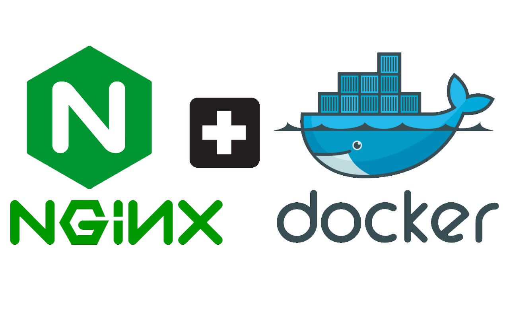

# Servidor de Arquivos Temporários com Nginx

Este conjunto de documentos visa fornecer uma compreensão abrangente sobre a implementação e utilização de um servidor de arquivos temporários usando Nginx. O primeiro documento detalha a configuração e a implementação do servidor, incluindo a estrutura de pastas, os arquivos de configuração e as instruções para configurar o servidor dentro de um container Docker. O segundo documento complementa o primeiro, fornecendo exemplos práticos de como interagir com o servidor para enviar e recuperar arquivos, utilizando tanto Python quanto cURL.

## Objetivo

O objetivo principal destes documentos é facilitar a replicação da configuração do servidor de arquivos temporários, permitindo que desenvolvedores e administradores de sistema possam rapidamente configurar e utilizar o Nginx para servir arquivos temporários. Além disso, os exemplos práticos fornecidos visam ilustrar como realizar operações comuns de upload e download de arquivos de maneira segura e eficiente.

## Conteúdo dos Documentos

1. [**Documentação de Implementação do Servidor de Arquivos Temporários com Nginx**](create_file_server.md)
   - **Descrição do Nginx**: Uma introdução ao Nginx, incluindo sua história, funcionalidade principal e usos comuns.
   - **Nginx para Servidor de Arquivos Temporários**: Razões para escolher Nginx para esta finalidade, benefícios de sua utilização no contexto de uma API e exemplos práticos.
   - **Implementação do Servidor**: Instruções detalhadas sobre a configuração do servidor, incluindo a estrutura de pastas, arquivos de configuração e scripts necessários.
   - **Configuração do Servidor**: Descrição e explicação dos arquivos `server.conf`, `nginx.conf`, e `delete_old_files.sh`, além do arquivo `.htpasswd` para autenticação.
   - **Criação do Dockerfile e Docker Compose**: Instruções para construir a imagem Docker e iniciar o container, integrando o servidor com a API para segurança aprimorada.

2. [**Documentação de Utilização do Servidor**](test_file_server.md)
   - **Enviando Arquivos para o Servidor**: Código Python de exemplo para envio de arquivos com autenticação básica.
   - **Recuperando Arquivos do Servidor**: Código Python de exemplo para recuperação de arquivos.
   - **Utilização com cURL**: Comandos cURL para enviar e recuperar arquivos, com explicações detalhadas.

Ultima atualização 29/07/2024.
