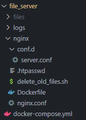

# Documentação do Servidor de Arquivos Temporários com Nginx


## O que é o Nginx?

O Nginx (pronuncia-se "Engine-X") é um servidor web de código aberto e um servidor proxy reverso, desenvolvido originalmente por Igor Sysoev e lançado em 2004. Ele é amplamente utilizado por sua alta performance, estabilidade, recursos ricos, configuração simples e baixo consumo de recursos. Além de servir páginas web, o Nginx é muito utilizado como proxy reverso, balanceador de carga, cache HTTP e servidor de arquivos estáticos.


## Nginx para Servidor de Arquivos Temporários

Utilizar o Nginx dentro do Docker Compose durante a implementação inicial da API pode ser uma boa opção devido à facilidade de configuração e alta performance do Nginx. Ele pode servir eficientemente como um intermediário para a disponibilização de arquivos temporários criados pela API, garantindo que esses arquivos sejam acessíveis ao usuário apenas por um período determinado, aumentando a segurança e gerenciamento dos recursos.


# Implementação do Servidor de Arquivos Temporários

## Arquitetura de Pastas do Projeto para Criação do Servidor




- `files`: Pasta local que será espelhada com a pasta dentro do container para armazenar os arquivos temporários.
- `logs`: Pasta local para armazenar os logs do servidor.
- `nginx`: Contém as configurações do servidor.
  - `conf.d/server.conf`: Configurações específicas do servidor.
  - `.htpasswd`: Arquivo de autenticação de usuários.
  - `delete_old_files.sh`: Script para deletar arquivos antigos.
  - `Dockerfile`: Arquivo para construção da imagem Docker.
  - `nginx.conf`: Configuração geral do Nginx.
- `docker-compose.yml`: Arquivo Docker Compose para orquestração dos containers.


## Configurações de Entrada e Saída do Servidor

### Arquivo: `server.conf`

```nginx
server {
    listen 8080;
    server_name nginx;

    location / {
        root /usr/share/nginx/html;
        autoindex on;
    }

    location /upload {
        alias /usr/share/nginx/html/files/;
        client_max_body_size 100M;

        dav_methods PUT DELETE MKCOL COPY MOVE;
        create_full_put_path on;
        dav_access user:rw group:rw all:r;

        auth_basic "Restricted Access";
        auth_basic_user_file /etc/nginx/.htpasswd;

        if ($request_method = 'OPTIONS') {
            add_header 'Access-Control-Allow-Origin' '*';
            add_header 'Access-Control-Allow-Methods' 'GET, POST, OPTIONS, PUT, DELETE';
            add_header 'Access-Control-Allow-Headers' 'Authorization, Origin, X-Requested-With, Content-Type, Accept';
            return 204;
        }

        if ($request_method = 'PUT') {
            add_header 'Access-Control-Allow-Origin' '*';
            add_header 'Access-Control-Allow-Methods' 'GET, POST, OPTIONS, PUT, DELETE';
            add_header 'Access-Control-Allow-Headers' 'Authorization, Origin, X-Requested-With, Content-Type, Accept';
            set $upload_link http://$host/get$uri;
            add_header Upload-Link $upload_link;
        }

        access_log /var/log/nginx/upload_access.log;
        error_log /var/log/nginx/upload_error.log debug;
    }

    location /get {
        alias /usr/share/nginx/html/files/;
        autoindex on;

        if ($request_method = 'OPTIONS') {
            add_header 'Access-Control-Allow-Origin' '*';
            add_header 'Access-Control-Allow-Methods' 'GET, POST, OPTIONS, PUT, DELETE';
            add_header 'Access-Control-Allow-Headers' 'Authorization, Origin, X-Requested-With, Content-Type, Accept';
            return 204;
        }

        if ($request_method = 'GET') {
            add_header 'Access-Control-Allow-Origin' '*';
            add_header 'Access-Control-Allow-Methods' 'GET, POST, OPTIONS, PUT, DELETE';
            add_header 'Access-Control-Allow-Headers' 'Authorization, Origin, X-Requested-With, Content-Type, Accept';
        }
    }
}
```


### Explicação das Configurações

- **listen**: Define a porta na qual o servidor irá escutar (8080).
- **server_name**: Nome do servidor.
- **location /**: Define o diretório raiz para arquivos servidos e habilita a listagem automática de diretórios.
- **location /upload**: Configura o endpoint para upload de arquivos, incluindo diretivas para WebDAV, controle de acesso, e CORS.
- **location /get**: Configura o endpoint para recuperação de arquivos, incluindo controle de acesso e CORS.


## Configuração Geral do Servidor

### Arquivo: `nginx.conf`

```nginx
user  nginx;
worker_processes  1;

error_log  /var/log/nginx/error.log warn;
pid        /var/run/nginx.pid;

events {
    worker_connections  1024;
}

http {
    include       /etc/nginx/mime.types;
    default_type  application/octet-stream;

    log_format  main  '$remote_addr - $remote_user [$time_local] "$request" '
                      '$status $body_bytes_sent "$http_referer" '
                      '"$http_user_agent" "$http_x_forwarded_for"';

    access_log  /var/log/nginx/access.log  main;

    sendfile        on;
    keepalive_timeout  65;

    include /etc/nginx/conf.d/*.conf;
}
```


### Explicação das Configurações

- **user**: Define o usuário sob o qual o serviço do Nginx será executado.
- **worker_processes**: Define o número de processos de trabalho a serem usados pelo Nginx.
- **error_log**: Define o caminho do arquivo de log de erros e o nível de log.
- **pid**: Define o caminho do arquivo de PID para armazenar o ID do processo do Nginx.
- **events**: Configuração de eventos, definindo o número máximo de conexões que cada processo de trabalho pode abrir.
- **http**: Configurações HTTP, incluindo tipos MIME, formato de log, e configuração de conexões keep-alive.


## Configuração do Servidor para Tempo de Vida dos Arquivos

### Arquivo: `delete_old_files.sh`

```sh
#!/bin/sh

# Diretório onde os arquivos são armazenados
UPLOAD_DIR="/usr/share/nginx/html/files"

# Log de execução
echo "$(date) - Executando script de exclusão" >> /var/log/nginx/delete_files.log

# Verificar o diretório e os arquivos
ls -l "$UPLOAD_DIR" >> /var/log/nginx/delete_files.log

# Encontrar e excluir arquivos com mais de 10 minutos
find "$UPLOAD_DIR" -type f -mmin +10 -exec rm -f {} \; 2>> /var/log/nginx/delete_files.log

```


### Explicação do Script

Este script procura e exclui arquivos no diretório de uploads que tenham mais de 10 minutos.


## Arquivo de Autenticação de Usuários

### Arquivo: `.htpasswd`

```
xDz6tQGa55yGu7q:$apr1$u2v5469n$2L38MUR3gxsFN4kiOS5cw1
```


### Explicação do Arquivo

O arquivo `.htpasswd` contém o usuário e senha hash para autenticação básica. Neste exemplo, o usuário é `xDz6tQGa55yGu7q` e a senha é `qFUtf9jnyV5Y4b6`. O Nginx utiliza este arquivo para verificar as credenciais durante a autenticação básica, conforme configurado no `server.conf`.


## Arquivo Docker para Criação do Servidor

### Arquivo: `Dockerfile`

```dockerfile
FROM nginx:latest


# Instalar cron, apache2-utils e dos2unix
RUN apt-get update && apt-get install -y cron apache2-utils dos2unix


# Copiar arquivos de configuração do Nginx
COPY nginx.conf /etc/nginx/nginx.conf
COPY conf.d/server.conf /etc/nginx/conf.d/server.conf


# Copiar o script de exclusão
COPY delete_old_files.sh /usr/local/bin/delete_old_files.sh


# Converter o script para formato Unix
RUN dos2unix /usr/local/bin/delete_old_files.sh

# Copiar o arquivo de senha
COPY .htpasswd /etc/nginx/.htpasswd


# Configurar permissões para o script
RUN chmod +x /usr/local/bin/delete_old_files.sh


# Adicionar tarefa cron para excluir arquivos antigos a cada minuto
RUN (crontab -l ; echo "* * * * * /usr/local/bin/delete_old_files.sh") | crontab -


# Iniciar cron e nginx
CMD service cron start && nginx -g 'daemon off;'
```


### Explicação do Dockerfile

- **FROM nginx:latest**: Usa a imagem mais recente do Nginx.
- **RUN apt-get update && apt-get install -y cron apache2-utils**: Instala cron e apache2-utils.
- **COPY**: Copia os arquivos de configuração e scripts para o container.
- **RUN chmod +x**: Configura permissões para o script de exclusão.
- **RUN (crontab -l ; echo ...)**: Adiciona uma tarefa cron para excluir arquivos antigos a cada minuto.
- **CMD**: Inicia o serviço cron e o Nginx.


## Arquivo Docker Compose para Criação do Container para o Servidor

### Arquivo: `docker-compose.yml`

```yaml
version: '1'

services:
  nginx:
    build: ./nginx
    ports:
      - "8080:8080"
    volumes:
      - ./files:/usr/share/nginx/html/files
      - ./logs:/var/log/nginx
    networks:
      - nginx_network

networks:
  nginx_network:
    driver: bridge
```


### Explicação do Docker Compose

- **version**: Define a versão do Docker Compose.
- **services**: Define os serviços a serem orquestrados.
- **nginx**: Serviço do Nginx.
  - **build**: Define o diretório de construção do Dockerfile.
  - **ports**: Mapeia a porta 8080 do host para a porta 8080 do container.
  - **volumes**: Define volumes para persistência de arquivos e logs.
  - **networks**: Define a rede do Docker.


<sub>Ultima atualização 08/08/2024.</sub>
